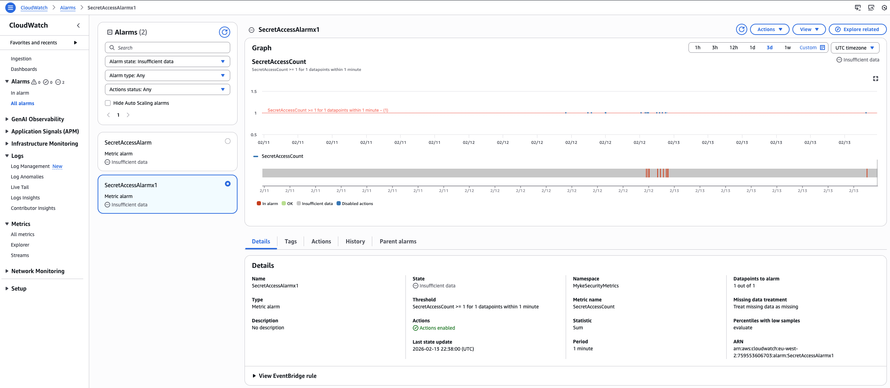
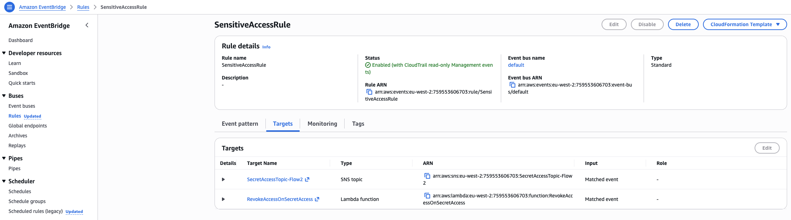
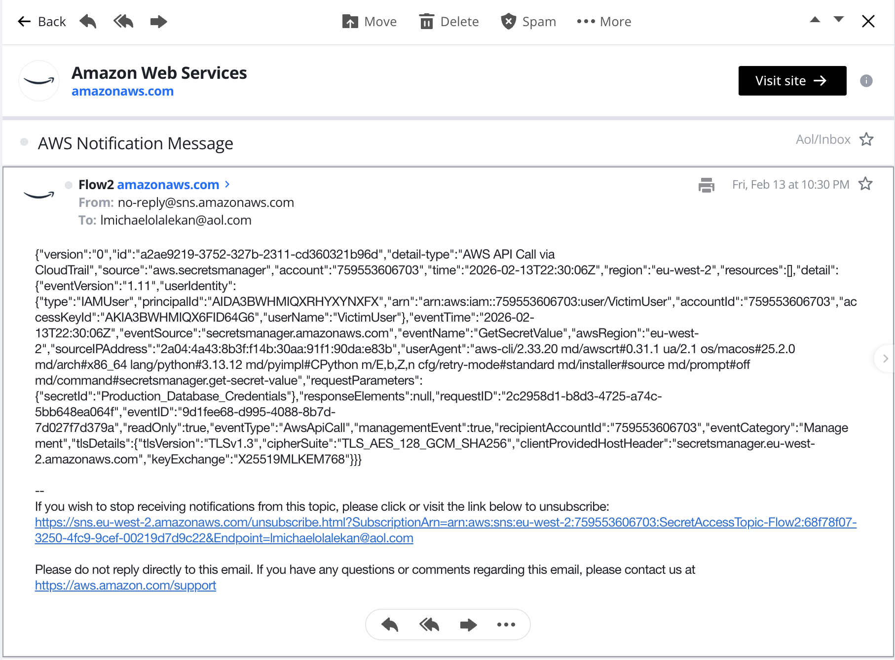
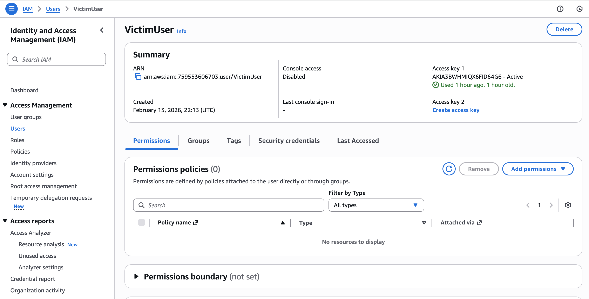
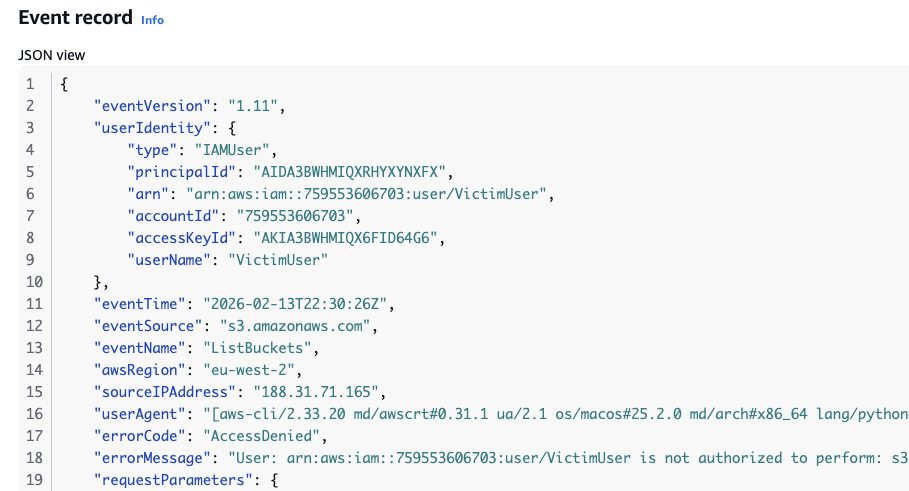
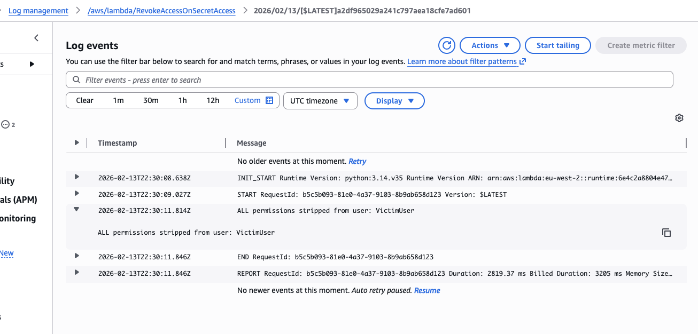

# AWS Cloud Security Monitoring System

**Real-time security monitoring and automated incident response on AWS.**  
Built and tested in region `eu-west-2` on 13th February 2026.

-----

## What This Project Does

This project monitors unauthorised access to sensitive credentials using AWS-native services. A honeytoken secret acts as a trap. The moment it’s accessed, two independent detection flows fire email alerts simultaneously, and a Lambda function automatically strips all IAM permissions from the offending user — in under 60 seconds.

The entire simulation ran end-to-end and was 100% successful.

-----

## Architecture

```
AWS Secrets Manager (honeytoken: Production_Database_Credentials)
        |
        ├── CloudTrail (multi-region trail → CloudWatch Logs)
        |       |
        |       └── Flow 1: CloudWatch Metric Filter + Alarm → SNS Topic → Email
        |
        └── Flow 2: EventBridge Rule (SensitiveAccessRule)
                        |
                        ├── SNS Topic (SecretAccessTopic-Flow2) → Email
                        └── Lambda (RevokeAccessOnSecretAccess) → Strip IAM permissions
```

**Services used:**

- AWS CloudTrail — multi-region trail with CloudWatch Logs integration
- AWS Secrets Manager — honeytoken secret (`Production_Database_Credentials`)
- Amazon CloudWatch — Metric Filter + Alarm (Flow 1)
- Amazon EventBridge — wildcard rule with `ENABLED_WITH_ALL_CLOUDTRAIL_MANAGEMENT_EVENTS` state (Flow 2)
- Amazon SNS — two separate topics, one per flow
- AWS Lambda — `RevokeAccessOnSecretAccess` kill-switch function

-----

## How the Simulation Worked

1. Created IAM user `VictimUser` with full permissions
1. Used AWS CLI to access the honeytoken secret: `aws secretsmanager get-secret-value --secret-id Production_Database_Credentials`
1. Both detection flows triggered instantly
1. SNS email alerts fired from both flows
1. Lambda revoked all IAM policies from `VictimUser` automatically
1. Ran a second CLI command (`aws s3 ls`) — returned `AccessDenied`

-----

## Evidence

### CloudTrail Event (secret access)

```json
{
  "eventTime": "2026-02-13T22:30:06Z",
  "eventSource": "secretsmanager.amazonaws.com",
  "eventName": "GetSecretValue",
  "awsRegion": "eu-west-2",
  "userIdentity": {
    "type": "IAMUser",
    "userName": "VictimUser",
    "arn": "arn:aws:iam::759553606703:user/VictimUser"
  },
  "requestParameters": {
    "secretId": "Production_Database_Credentials"
  }
}
```

### Lambda Log Output

```
ALL permissions stripped from user: VictimUser
```

### Second CLI Command Result

```
errorCode: "AccessDenied"
errorMessage: "User: arn:aws:iam::759553606703:user/VictimUser is not authorized to perform: s3..."
```

-----
## Key Evidence

| Evidence | Description |
|---|---|
| `cloudwatch-alarm.png` | CloudWatch SecretAccessAlarmx1 configuration |
| `eventbridge-rule.png` | SensitiveAccessRule with two targets (SNS + Lambda) |
| `sns-email-flow2.png` | Email notification received from Flow 2 (EventBridge) |
| `iam-victimuser-zero-policies.png` | IAM console showing VictimUser with zero attached policies |
| `cloudtrail-accessdenied.png` | CloudTrail log showing AccessDenied on second command |
| `lambda-logs.png` | Lambda CloudWatch logs showing permissions stripped |

*Screenshots are included in the `/screenshots` folder.*
## Screenshots

**CloudWatch Alarm**  


**EventBridge Rule**  


**SNS Email Alert**  


**IAM — Zero Policies**  


**CloudTrail — AccessDenied**  


**Lambda Logs**  



-----

## Security Analysis

**Speed:** Flow 2 (EventBridge) notified faster — typically under 60 seconds. Flow 1 (CloudWatch Metric Filter) has a built-in evaluation period that introduces a small delay.

**Context:** Flow 2 delivered richer alert data — exact username, source IP, full event details. This is what the Lambda function uses to identify who to revoke.

**Compliance:** This lab satisfies the Continuous Monitoring requirement of NIST SP 800-53 (CM-3 and SI-4) — real-time logging, detection, alerting, and automated response in a single pipeline.

-----

## Lessons Learned

For a production environment, I would use EventBridge (Flow 2) as the sole trigger for the kill-switch. It’s near real-time, delivers full event context to Lambda, and is more reliable than the CloudWatch metric approach.

Two technical fixes that weren’t obvious at first:

- The CloudWatch metric filter requires `%Production_Database_Credentials%` with wildcards — exact string matching misses events
- The EventBridge rule must be set to `ENABLED_WITH_ALL_CLOUDTRAIL_MANAGEMENT_EVENTS` state to catch read-only API calls like `GetSecretValue`

-----

## Full Report

The complete forensic report (with all screenshots and evidence) is available in [`AWS-Cloud-Security-Monitoring-Report.pdf`](./AWS-Cloud-Security-Monitoring-Report.pdf).

-----

*Part of my cybersecurity portfolio — [github.com/Bigmykeb](https://github.com/Bigmykeb)*
